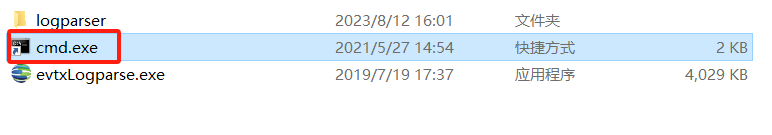
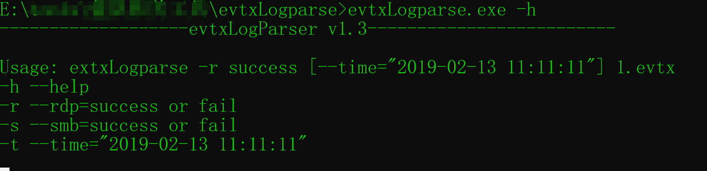
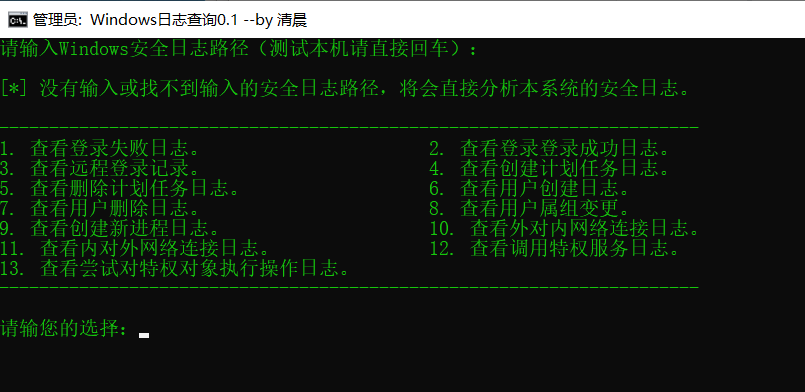
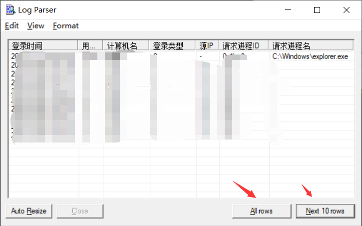

# 前言

1. 网上大多教程很多其实都是查看Windows的登录失败或者登录成功的日志，就是4624和4625的日志，还有登录类型，是3还是10之类的。嘛，主要针对爆破但是呢，现在有个问题，就是说我像查看黑客入侵后使用哪个程序进行的提权操作？之类的就听少的，而且也记不住啊。

2. 网上呢有些工具，其中https://github.com/dogadmin/windodws-logs-analysis，还有界面，挺好的工具呀，但是这种exe文件难免有人会觉得有没有投毒之类的。唉难哦。

3. 再对比从深信服拿到的evtxLogparse，啊这启动是双击cmd.exe的快捷方式。

   程序大小4MB左右，功能也是查看暴力破解的日志，感觉还是差了点意思啊，还挺low的。

   

而且这些工具还是要装LogParser的，其实就是调用了LogParser做查询，那。要不我也来写写？语句反正就是执行命令嘛，没必要搞成exe嘛，又不是啥机密的东西，为了兼容性，写python啥的不适合，万一人家电脑没装python咋办，还是得来批处理啊。

执行的语句也是网上各种copy来的，要增加查其他类型日志，可以自己加。

不过有些查看可能没日志，因为系统没开启相关的日志审核，所以没有。

# 使用

运行，选择就完了！查看本机日志需要管理员权限，所以有个UAC的弹框。

别和我说为啥数据那么少，你的注意点`ALL rows`和`Next 10 rwos`啊。

